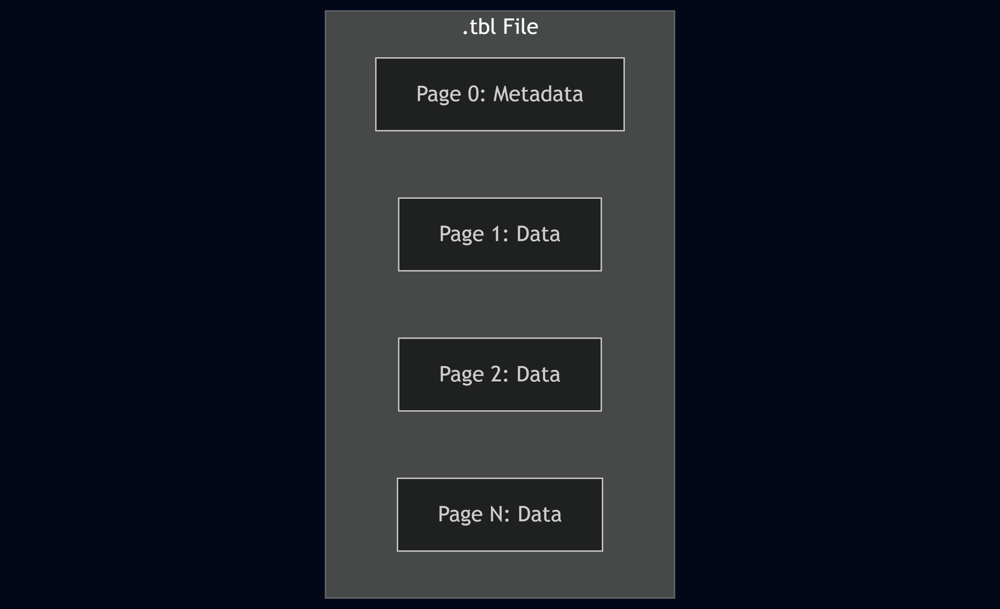
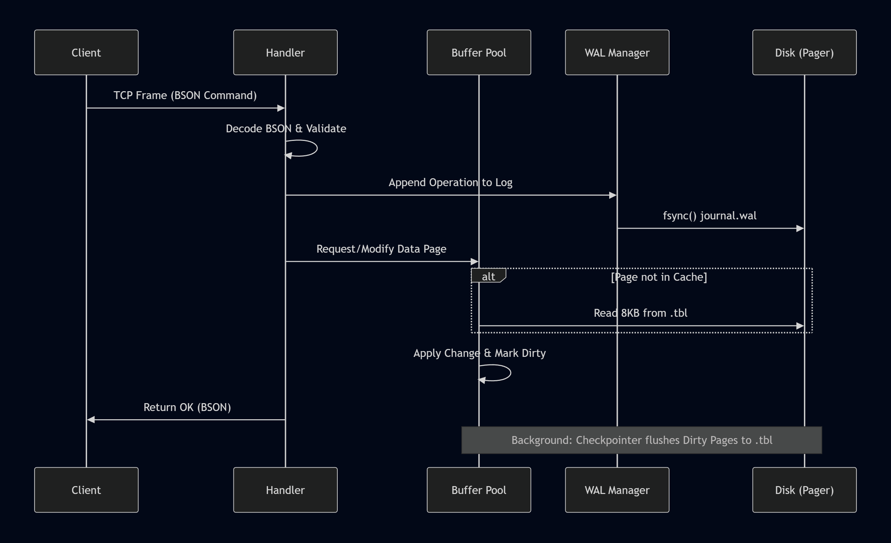

# ARCHITECTURE: Space DB Technical Specification

This document provides the exhaustive architectural blueprint for the **Space** database management system. Space is a high-performance, document-relational hybrid engine written in Rust, utilizing a custom binary storage format and a command-based communication protocol.

---

## 1. System Overview

The Space DBMS is architected as a set of decoupled layers, each responsible for a specific stage of the data lifecycle. The system prioritizes low-latency I/O and transactional durability.

| Layer | Component | Responsibility |
|:--- |:--- |:--- |
| **Transport** | TCP Server | Manages socket I/O on Port 4500 and connection pooling. |
| **Protocol** | Binary Framer | Encapsulates BSON commands into length-prefixed frames. |
| **Execution** | Command Processor | Validates and dispatches CRUD operations to the storage engine. |
| **Memory** | Buffer Pool | Caches 8KB binary pages using an LRU-K eviction policy. |
| **Persistence** | Slotted Pager | Manages physical disk I/O and Write-Ahead Logging (WAL). |

---

## 2. Transport and Protocol Layer

Space communicates over TCP using a custom binary framing protocol to ensure high-performance data transmission and request multiplexing.

### 2.1 Communication Specification
*   **Port:** 4500
*   **Mode:** Asynchronous (Non-blocking via Tokio)
*   **Primary Protocol:** Length-Prefixed Binary Messaging

### 2.2 Binary Frame Structure
Every message sent to or from Space must conform to the following 10-byte header format followed by the payload and a trailing checksum.

| Field | Size (Bytes) | Type | Description |
|:--- |:--- |:--- |:--- |
| **Message Length** | 4 | uint32 | Total length of the frame (Header + Payload + Checksum). |
| **Request ID** | 4 | uint32 | Sequence number used for asynchronous multiplexing. |
| **OpCode** | 2 | uint16 | Operation identifier (0x00: Ping, 0x01: Command). |
| **Payload** | Variable | BSON | The encoded data exchange document. |
| **Checksum** | 4 | uint32 | CRC32 for frame integrity validation. |

---

## 3. Data Exchange Format (BSON Command Logic)

Space utilizes **BSON (Binary JSON)** as its native data exchange format. BSON provides a zero-copy friendly, type-rich serialization that supports binary data, 64-bit integers, and nested documents.

### 3.1 Command Structure
All interactions with the database are initiated via a BSON "Command Document." A standard request must contain a `command` and a `collection` field.

**Example: Find Operation (Logical Representation)**
```json
{
  "command": "find",
  "collection": "users",
  "filter": {
    "username": "sarthak"
  },
  "limit": 10
}
```

### 3.2 Response Structure
The server responds with a BSON document containing a status indicator (`ok`) and the requested data or error message.

| Field | Type | Description |
|:--- |:--- |:--- |
| **ok** | Int32/Bool | 1 for success, 0 for failure. |
| **cursor** | Document | Contains the result set for `find` operations. |
| **n** | Int32 | Number of documents affected (for `insert`/`update`). |
| **errmsg** | String | Description of the error (only if `ok` is 0). |

### 3.3 Type Mapping
| BSON Type | Space Internal Type | Description |
|:--- |:--- |:--- |
| **Double** | Float64 | 64-bit IEEE 754 floating point. |
| **String** | UTF-8 String | Length-prefixed character data. |
| **Document** | Nested BSON | Used for the hybrid "document" part of records. |
| **Binary** | Byte Blob | Raw bytes stored in the slotted page. |
| **Int64** | Int64 | 64-bit signed integer. |

---

## 4. Storage Architecture

Space uses a page-based storage model where all data is organized into fixed-size units to align with hardware sectors and OS memory management.

### 4.1 Physical File Layout
Data is stored in `.tbl` files. Internally, these files are an array of 8192-byte (8KB) pages.



### 4.2 Slotted Page Anatomy
To handle variable-length documents (BSON) alongside structured data (INT64, VARCHAR), Space employs a Slotted Page architecture.

| Offset | Field | Size | Description |
|:--- |:--- |:--- |:--- |
| 0 | **LSN** | 8 | Log Sequence Number for WAL recovery. |
| 8 | **Checksum** | 4 | CRC32 of page content. |
| 12 | **Slot Count** | 2 | Number of records in the page. |
| 14 | **Upper** | 2 | Pointer to the end of the slot array. |
| 16 | **Lower** | 2 | Pointer to the start of the record data. |
| 18 | **Space** | 2 | Remaining free bytes in the page. |
| 20 | **Slot Array** | 4 * N | List of (Offset, Length) pairs. |
| ... | **Free Space** | Var | Unallocated space growing toward the bottom. |
| 8192 | **Records** | Var | Actual data blocks growing toward the top. |

---

## 5. Memory Management (Buffer Pool)

The Buffer Pool Manager (BPM) sits between the execution engine and the disk. It minimizes disk latency by keeping frequently accessed pages in memory.

### 4.1 LRU-K Eviction Policy
Space utilizes the LRU-K algorithm to manage page eviction. Unlike standard LRU, LRU-K tracks the time of the last $K$ references to a page, effectively protecting the cache from being flushed by one-time full table scans.

### 4.2 Page States
| State | Description |
|:--- |:--- |
| **Clean** | Page in memory matches the page on disk. |
| **Dirty** | Page has been modified and must be written to disk before eviction. |
| **Pinned** | Page is currently being accessed by a transaction and cannot be evicted. |

---

## 6. Transactional Integrity (ACID)

Space ensures Atomicity, Consistency, Isolation, and Durability through the ARIES recovery protocol and Write-Ahead Logging.

### 6.1 Write-Ahead Logging (WAL)
Every mutation (Insert, Update, Delete) is appended to a sequential log file (`journal.wal`) and synchronized with the storage hardware via `fsync` before the corresponding data page is modified in memory.

### 6.2 Recovery Logic
During system startup, Space performs a three-stage recovery:
1.  **Analysis:** Scans the WAL to identify dirty pages and active transactions.
2.  **Redo:** Re-applies all committed changes from the WAL that are not yet in the `.tbl` files.
3.  **Undo:** Rolls back any changes from transactions that did not reach a "Commit" state before a crash.

---

## 7. Command Execution Pipeline

The following flowchart details the lifecycle of a BSON command from the network to the physical disk.



---

## 8. Catalog and Schema

Space maintains a global system catalog to store metadata about collections and indexes.

| Meta-field | Type | Description |
|:--- |:--- |:--- |
| **Table Name** | String | The unique identifier for the collection. |
| **Root Page** | uint32 | The starting page of the collection's B+ Tree. |
| **Column Definitions** | Map | Definitions of structured fields (Name, Type). |
| **Indexes** | List | List of B+ Trees associated with the table. |

---

## 9. Development Standards

*   **Memory Safety:** No `unsafe` code allowed in the Transport or Command layers; restricted to low-level binary casting in the Storage layer using crates like `zerocopy`.
*   **Error Handling:** Explicit result propagation using the `thiserror` crate; no `panic!` or `unwrap()` in the server execution path.
*   **Concurrency:** Non-blocking I/O using `tokio`; fine-grained page locking via `parking_lot::RwLock`.
*   **Zero-Copy:** Data is cast directly from binary page buffers to structs where possible to minimize CPU cycles during serialization.